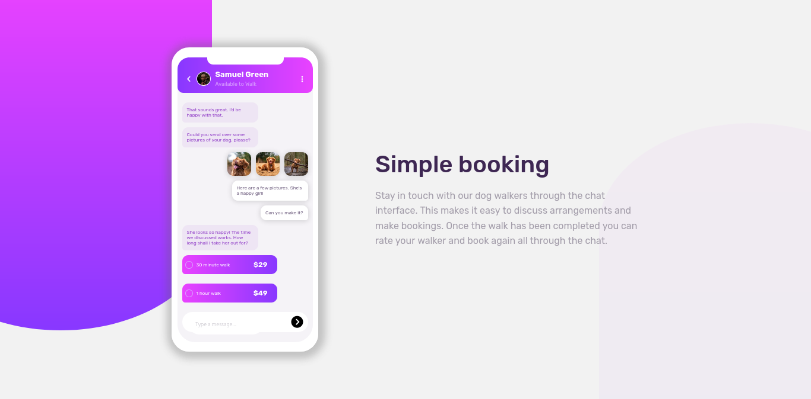
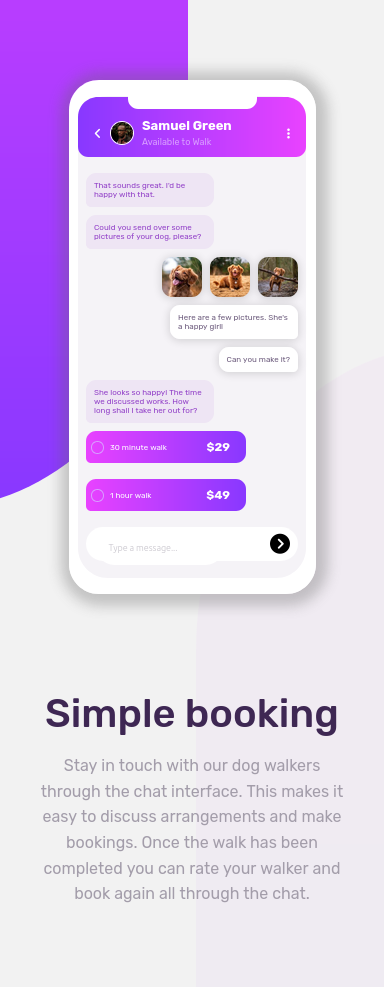

# Frontend Mentor - Chat app CSS illustration solution

This is a solution to the [Chat app CSS illustration challenge on Frontend Mentor](https://www.frontendmentor.io/challenges/chat-app-css-illustration-O5auMkFqY). Frontend Mentor challenges help you improve your coding skills by building realistic projects. 

## Table of contents

- [Overview](#overview)
  - [The challenge](#the-challenge)
  - [Screenshot](#screenshot)
  - [Links](#links)
- [My process](#my-process)
  - [Built with](#built-with)
  - [Useful resources](#useful-resources)
- [Author](#author)

## Overview

### The challenge

Users should be able to:

- View the optimal layout for the page depending on their device's screen size
- See hover states for all interactive elements on the page

### Screenshot

### Links

- [Solution(https://www.frontendmentor.io/solutions/chat-app-css-illustration-T8MyTj3gJD)
  
- [Live Site URL](https://alaa-mekibes.github.io/chat-app-css-illustration-frontend-mentor)

## My process

### Built with

- Semantic HTML5 markup
- CSS custom properties
- Flexbox

### Useful resources

- [Font Awesome](https://fontawesome.com/) - This helped me for adding icons to my website

## Author

- Frontend Mentor - [@alaa-mekibes](https://www.frontendmentor.io/profile/alaa-mekibes)
